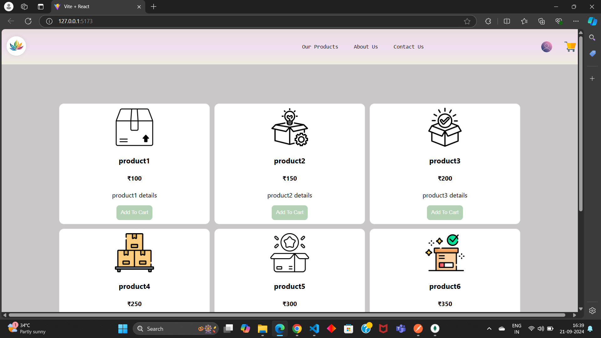

      

        

            <h1>
                DTDL problem statement
            </h1>
        

        

            
        

        

            <h3>
              Tech Stacks
            </h3>
            

                
                
                
                
                
                
                
                
                
                
            

            

                This web app has the following functionality and features :
                <ul>
                    <li>Login</li>
                    <li>Logout</li>
                    <li>Pagination</li>
                    <li>Cart</li>
                    <li>Cart Sharing</li>
                    <li>Product List Display</li>
                    <li>Good UI/UX Designing</li>
                    <li>Routing and Redux store</li>
                    <li>Chat for Cart</li>
                    <li>Header, Footer, Main Content</li>
                    <li>Media Responsive Design, flexible for big, medium and small screen</li>
                    <li>JWT Authentication using NodeJS, expressJS, mongoDB, and NPM</li>
                </ul>
            

        

        

            <a href="https://github.com/erjyotigoswami9/chalang_hackfest24" target="_blank">
            

              
              
Github Repository Link

            

            </a>
            <a href="https://github.com/erjyotigoswami9/chalang_hackfest24" target="_blank">
            

                
                
Deployment Link

            

            </a>
        

      

    

